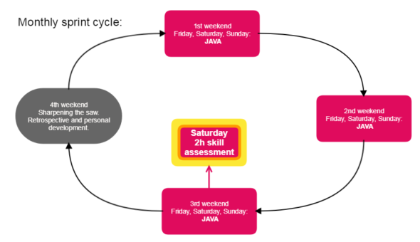
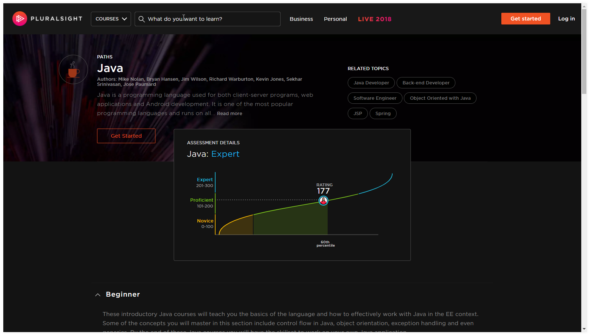

_Image: sunset taken from the ferry Kristiansand (N) - Hirtshals (DK)_
# Inleiding

In dit repository deel ik één van mijn doelen: [**Java developer worden**](./#doel-java-developer-worden). Ik stel mijzelf regelmatig de vraag: "wat is het volgende niveau?", om erachter te komen hoe ik verder kan komen.
Welke actie heeft de grootste impact? Wat brengt het meeste resultaat? Wat brengt mij het snelst dichter bij mijn doel? Door voortschrijdend inzicht zal ik regelmatig mijn doel bijstellen. De wijzigingen zijn inzichtelijk door version control.
Dit repository is ook bedoeld om vorderingen bij te houden, en te delen met coaches.

Dutch English (Dunglish) warning.

# Metadata

<dl>
<dt>Titel</dt>
<dd>Invidueel Plan</dd>
<dt>Naam</dt>
<dd><a href="eimertvink.nl" target="_blank">eimertvink.nl</a></dd>
<dt>Periode</dt>
<dd>Augustus 2018 t/m augustus 2019</dd>
<dt>Aanmaakdatum</dt>
<dd>08-08-2018</dd>
<dt>Laatste wijziging</dt>
<dd>Zie datum laatste commit.</dd>
</dl>

# Doel: Java developer worden

Mijn primaire doel voor 2018 is om Java developer te worden. Het doel staat op internet voor gemakkelijke toegang, en om dagelijks opnieuw erop te focussen. Ik zal regelmatig mijn plan aanpassen, omdat ik ondertussen ook bezig ben om een steeds beter begrip te krijgen van de (nitty-gritty) details die ik wil leren.

### Tijdbestek
April 2018 tot 'december 2018'. Eigenlijk stopt het leren nooit ;-). Ik kies ervoor om de omvang van dit doel/project te beperken.

### Wanneer klaar (DoD)?
Dit doel is afgerond als ik de overstap kan maken naar een Java development functie.

### [Roadmap (open in tab)](https://app.teamweek.com/#pg/yF5TIH9mGG_qy8BR3k4SdS8XFd6oGDde?zoom=3months)
<iframe src="https://app.teamweek.com/#pg/yF5TIH9mGG_qy8BR3k4SdS8XFd6oGDde?zoom=3months" scrolling="yes" height="590px" width="590px" target="_blank"></iframe>

### What drives me (to reach this goal)?
Why? I'd like to challenge myself to become a better engineer. My talent is having a well organized and structured approach towards providing IT
solutions.

I want to do work that is mentally challenging. Why? Because taking on and solving hard challenges is mentally (very) rewarding. My
weak point is that I tend to do more than is requested, and thus spend a bit more time perfecting things. I get inspired by people having high(er)
standards and exceptional skill(s). Why software development? I believe my strong points are matching the ideal profile of a developer. I'm well
organized, structured and very thorough in my work. I'd like to create software that can be used on a global scale.

### Why software development?
Because I've formally just started in this field, I want to get a better understanding of the different specializations within software development.
For now, I've chosen back-end development, since I like the underlying infra as well. Back-end development is closest to what I've been doing in
the past. Those skills are complimentary. I've gathered some interesting ideas to work on. Let's leverage my ideas as learning projects, to learn programming. Let's become a software
developer. Let's go :).

How about starting off with small, overseeable projects, and work towards bigger projects? May 2018: [Salary-API](https://github.com/Eimert/Salary-API).

### Why Java?
Java is a well-established programming language worldwide. Java is widely used within the company I work for. I'm enthousiastic about open source and guys like Richard Stallman. I'd love to learn Java in order to write API's and eventually a few Android apps. It would be great to 'materialize' some app ideas, just for learning purposes and to show friends.

### Desired result?

In Q42018 I want to be a developer proficient in:
*   Java 8
*   Spring and sub-projects (Data, REST, Security).
*   Writing API's
*   Good coding practices (clean code)
*   Writing unit tests (JUnit, Mockito)
*   Utilizing public cloud providers (Heroku)
*   Build and deployment pipelines

Foundational knowledge (I'll need to work on):
*   Data structures
*   Algorithms
*   Distributed systems
*   Mathematics?
*   Statistics?
*   Logic?

Future job: back-end developer

### Time commitment?
I'll learn in my spare time, in the weekend and sometimes in the evening. My company allowed me to spend a few working hours on learning as well.

To sum it all up, I can at least commit my Saturday, Sunday and Monday, 3 * 8h = **24h per week**.

I work in cycles, with one retrospective weekend per month. This is my four week sprint:

### How to measure progress?

I'll do one skill-assessment every month, on sites like pluralsight and hackerrank. Preferably both. End of 2018 / beginning of 2019 I want to reach '_proficient_' (101-200) on pluralsight (Java):

_Image: Java learning path on pluralsight._

Coding tests:
1. Pluralsight assessments
2. OCA practise exams.
3. [ Hackerrank, codility, other site ] coding assessment.

### References

[Reddit - faq - learnprogramming](https://www.reddit.com/r/learnprogramming/wiki/faq#wiki_getting_started)
[John Sonmez - Simpleprogrammer.com](https://simpleprogrammer.com/)

[back to home](./)
['](./index-original.html)
